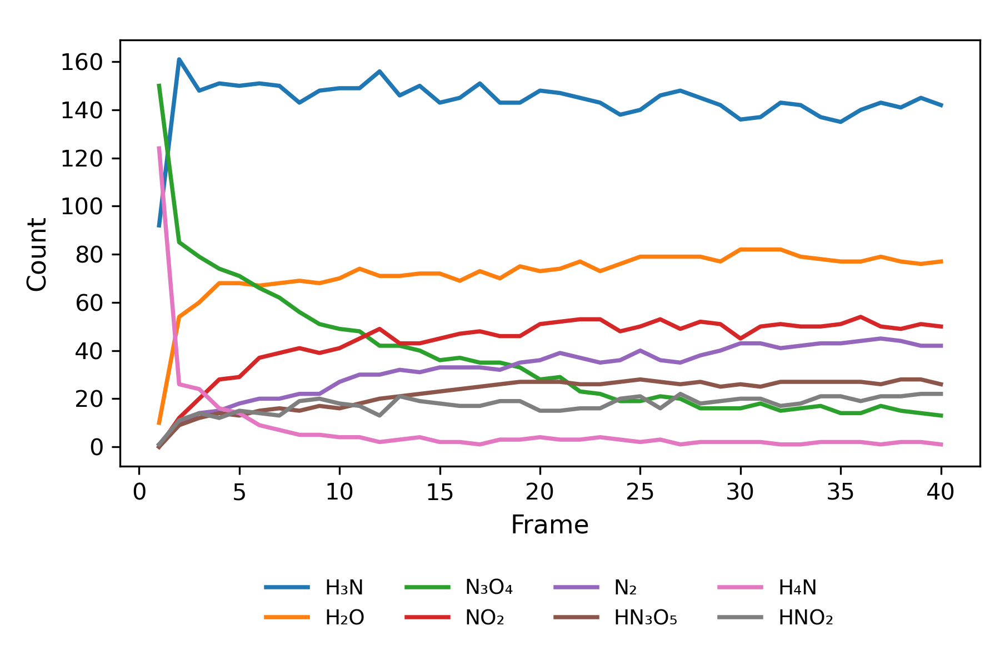
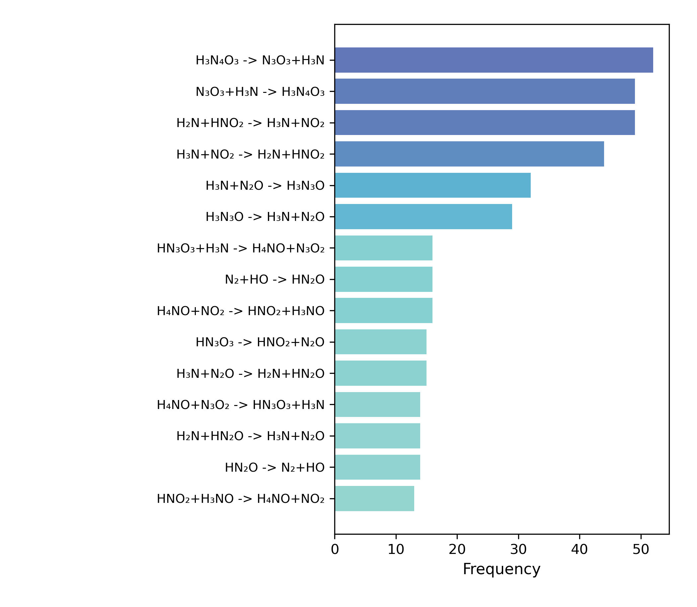
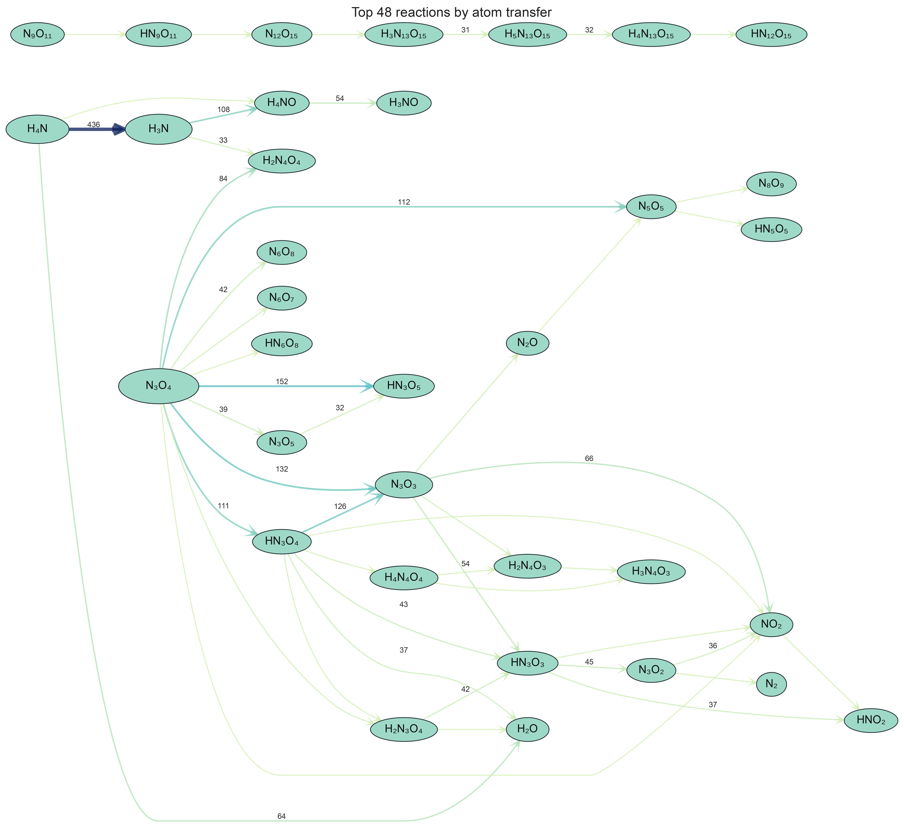

# ReaxTools 2.1

ReaxTools is a local post-processing toolkit for reactive molecular dynamics trajectories from LAMMPS, GPUMD, CP2K, and related workflows.

Version 2.1 is a major cleanup release. The C++ core now writes stable raw audit files, while Python owns filtering, plotting, and presentation. The atom-transfer table is auditable from raw reaction events; `plot` and `network` provide compact molecule-transfer and reaction-transfer diagrams.

## Install

```bash
git clone https://github.com/tgraphite/reax_tools
cd reax_tools
bash install_reax_tools.sh
```

The installer builds `bin/reax_tools_core`, creates a project-local Python virtual environment (`venv/`) with Python 3.8+, installs lightweight plotting dependencies from `bin/requirements.txt`, and adds `bin/` to `PATH`. The `reax_tools` command automatically runs inside the venv when it exists.

Requirements:

- CMake 3.14+ and a C++17 compiler (GCC 9+ recommended; GCC 8.x is also supported and links `libstdc++fs` automatically).
- Python 3.8+ (the installer searches for `python3.8` … `python3.13`; a conda environment also works).

The default local build does not require RDKit, Boost, Graphviz, or bundled shared libraries.

You can also build the C++ core directly without the Python layer:

```bash
cmake -S . -B build -DCMAKE_BUILD_TYPE=Release
cmake --build build -j
./bin/reax_tools_core -f test/energetic.xyz -o reax_tools_output
```

## Quick Start

Analyze a trajectory:

```bash
reax_tools -f test/energetic.xyz -o test/energetic_v3
```

`reax_tools -f ...` is a shortcut for analyze mode. The explicit form is also supported:

```bash
reax_tools analyze -f trajectory.xyz -o reax_tools_output
```

Generate the default plots from an output directory:

```bash
reax_tools plot -f test/energetic_v3
```

Inspect available commands:

```bash
reax_tools
reax_tools analyze --help
reax_tools network --help
```

## Input Notes

ReaxTools supports:

- Extended XYZ, including common GPUMD and CP2K outputs with element symbols.
- Plain XYZ for non-periodic systems.
- LAMMPS dump files, usually with `-t C,H,O,N` to map numeric atom types.

For LAMMPS dump files, the atom columns should include stable atom ids, atom type, and coordinates. If a file is non-standard, converting through OVITO to Extended XYZ is usually the cleanest solution.

Useful analyze options:

```bash
reax_tools -f traj.xyz -o out
reax_tools -f dump.lammpstrj -t C,H,O,N -o out
reax_tools -f traj.xyz -r 1.1
reax_tools -f traj.xyz -tr N:1.5 O:1.6
reax_tools -f traj.xyz -tv N:4 O:3
reax_tools -f traj.xyz --no-rings
```

`-r` controls the van der Waals radius scale used for bond perception. Smaller values give stricter, more fragmented molecules; larger values give looser, larger molecules.

## Raw Outputs

The C++ core writes raw, audit-oriented files:

| File | Meaning |
| --- | --- |
| `species_count.csv` | Species count table: `frame,molecule_id,formula,count` |
| `bond_count.csv` | Bond-type counts by frame |
| `atom_bonded_num_count.csv` | Atom coordination counts by frame |
| `ring_count.csv` | Ring counts by frame |
| `reaction_events.csv` | Lightweight reaction-event index: frame, arity, hashes, and formulas |
| `reaction_event_pairs.csv` | Per-event atom-overlap pairs used to audit atom transfer |
| `transfer_flow.csv` | Aggregated atom transfer between molecular species |
| `reaction_snapshots/` | C++ reaction snapshot packages for montage rendering |
| `molecules.json` | Molecule identity records and example graph definitions |
| `reax_tools.log` | Run metadata and audit notes |
| `reax_tools_manifest.json` | Structured file manifest for Python and web clients |

`molecules.json` is the identity anchor. Current ids use the deterministic `formula-hash-v2` (FNV-1a); future structural hashes can replace this without changing the audit model.

## Audited Transfer

The reaction-transfer analysis is based on atom ownership transfer. `reaction_events.csv` is a compact event index, while `reaction_event_pairs.csv` records per-event reactant-product atom overlaps. `transfer_flow.csv` is exactly the aggregation of `reaction_event_pairs.csv`. For single- and bimolecular snapshot rendering, the C++ core writes self-contained `.rxtsnap.json` packages under `reaction_snapshots/`.

Run the built-in audit:

```bash
python3 tools/check_reax_outputs.py test/energetic_v3 \
  --expect-events 1415 \
  --expect-transfer-edges 984 \
  --expect-self-loop-count 115

python3 tools/audit_event_network_consistency.py test/energetic_v3 \
  --expect-event-pairs 4695
```

For the bundled `gpumd_v3` fixture, the event-network audit also passes:

```text
reaction events: 6522
reaction event pairs: 72471
transfer edges: 18391
atom transfer total: 1733312
```

This is the core v2.1 guarantee: the raw event layer and the full atom-transfer table are consistent and auditable. Filtered plots are presentation products.

## Plotting Commands

Default plots:

```bash
reax_tools plot -f test/energetic_v3
```

Individual products:

```bash
reax_tools counts -f test/energetic_v3
reax_tools counts -f test/energetic_v3 -t H2O,N2,H3N
reax_tools events -f test/energetic_v3 --max 15
reax_tools network -f test/energetic_v3 --max-reactions 60
reax_tools snapshots -f test/energetic_v3
reax_tools flow -f test/energetic_v3
reax_tools focus -f test/energetic_v3 --centers H3N N3O4 H2O
```

`plot` and the default `network` command write two transfer diagrams:

- `molecule_transfer_top24.png`: the 24 most active molecular species and their direct transfers.
- `reaction_transfer_top48.png`: the 48 strongest reaction transfers and the molecular species involved.

`network` also accepts explicit chemical filters:

- `--max-reactions N`: keep the strongest N reaction transfers.
- `--max-molecules N`: keep the strongest N molecular species and the direct transfers among them.
- `--max-subgraphs N`: keep the largest connected molecule groups.

These filters combine with AND semantics. `flow` remains an explicit experimental command for one-way role-layer summaries.

## Energetic Example

The bundled energetic fixture is ammonium dinitramide decomposition. The audited raw transfer table shows the main pathway from `H4N` and `N3O4` through nitrogen-oxygen intermediates toward products such as `H2O` and `N2`.

Species counts:



Reaction-event summary:



Molecule-transfer view:


Reaction-transfer view:



## Plot Style Templates

Python plotting reads YAML settings in this order:

1. Command-line `--template`.
2. `reax_tools_plot.yaml` or `reax_tools_template.yaml` in the output directory.
3. Bundled `src/python/reax_tools_viz/default_plot_template.yaml`.

This lets the C++ raw output remain stable while plot style evolves in Python.

## Repository Layout

```text
reax_tools/
├── install_reax_tools.sh       # one-step local install
├── bin/
│   ├── reax_tools              # user-facing command router
│   ├── reax_tools_core         # C++ analysis core
│   └── requirements.txt        # Python plotting dependencies
├── src/
│   ├── cpp/                    # raw analysis core
│   └── python/reax_tools_viz/  # plotting and filtering layer
├── tools/                      # audit utilities
└── test/                       # small fixtures and v2.1 example outputs
```

## Citation

If ReaxTools helps your work, please cite or acknowledge:

```text
Hanxiang Chen. ReaxTools: A high performance ReaxFF/AIMD/MLP-MD
post-process code [Computer software].
https://github.com/tgraphite/reax_tools
```
