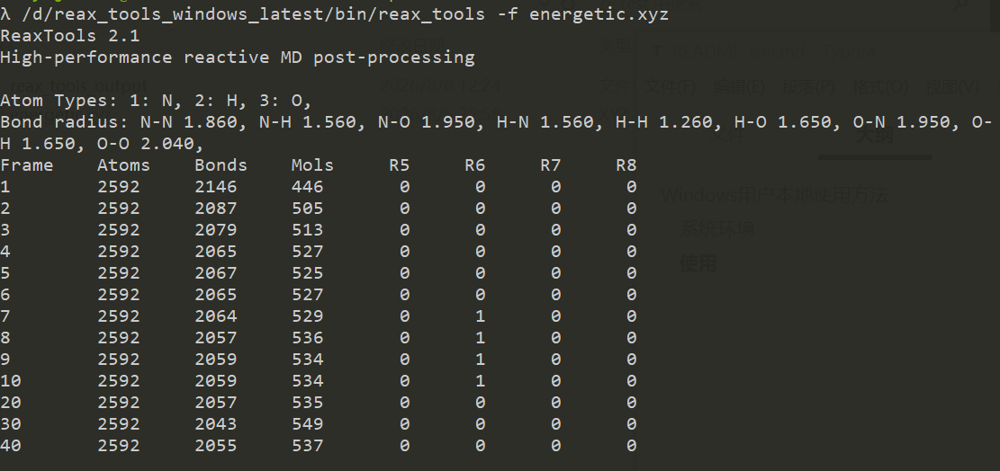
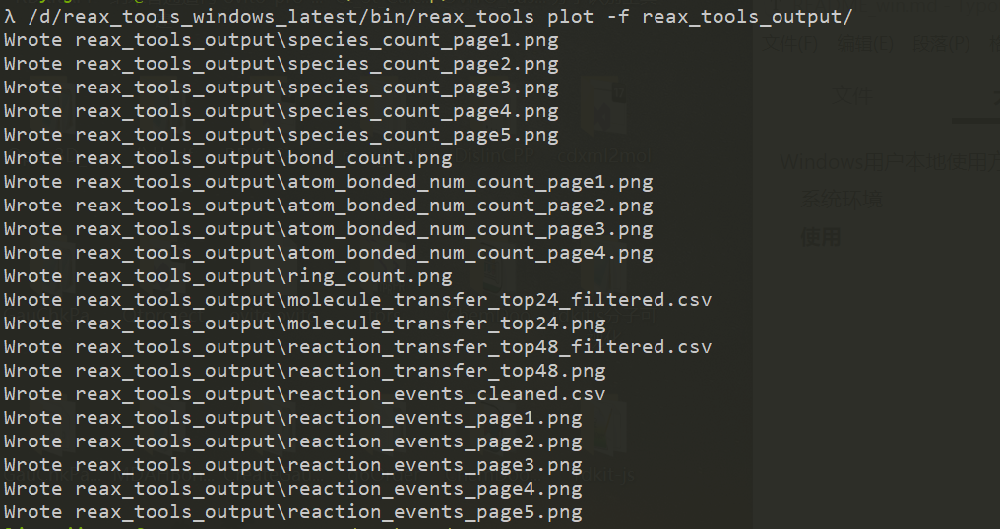
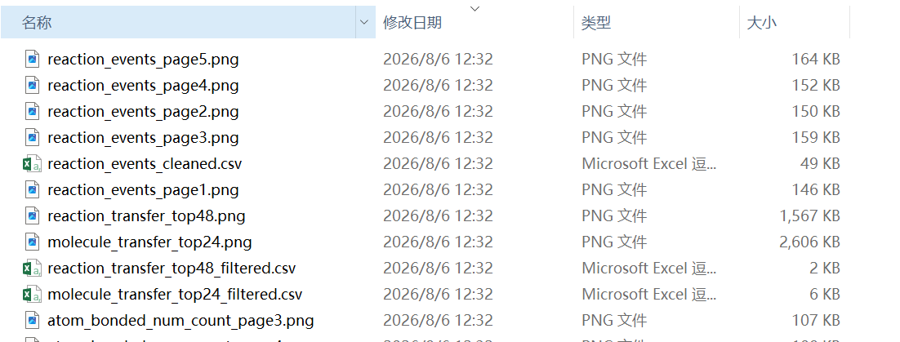

# Windows用户本地使用方法

## 系统环境

* Python版本要求和依赖包和原文档一致

* 需要有一个shell环境，这里推荐使用[cmder](https://cmder.app/)中的shell环境，因为目前最新的这个reax_tools调用有部分依赖bash环境（🤦之前是不需要的）

* 不需要编译，即不需要运行什么`bash install_reax_tools.sh`去编译它

  

## 使用

下载预编译版本[https://github.com/liuyujie714/reax_tools/releases/tag/bleed](https://github.com/liuyujie714/reax_tools/releases/tag/bleed)`reax_tools_windows_latest.tar.gz`压缩包，解压，比如我这里放在`D`盘。因为Windows系统字体原因，后期python得到的某些图可能无法正确显示分子式中的下标，所以修改`D:\reax_tools_windows_latest\src\python\reax_tools_viz\default_plot_template.yaml`的字体名称：

修改前：

```
fontname: Arial
```

修改后：

```
fontname: "Segoe UI"
```


调用方式在cmder中的`shell`命令行下运行，唯一区别是需要指定`reax_tools`的完整路径（全或者相对路径均可）来完成调用，比如：

```bash
/d/reax_tools_windows_latest/bin/reax_tools -f energetic.xyz
/d/reax_tools_windows_latest/bin/reax_tools plot -f reax_tools_output/
```










